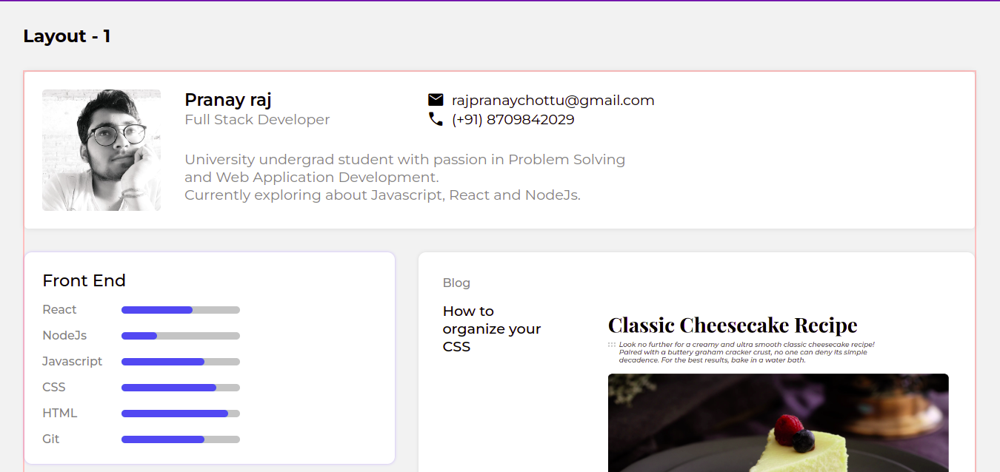

<h1 align="center">Portfolio-components</h1>

  

This repo contains the solution to the Last Challenge ( and the hard one :) ) from the Responsive Web Developer Track at [DevChallenges.io](http://devchallenges.io/https://devchallenges.io/challenges/5ZnOYsSXM24JWnCsNFlt)

Live Link : [Click Here](https://masterpranay1.github.io/portfolio-components)

## Built With 
- HTML5
- SCSS
  - Partials
  - Mixins

## Features
- Fully Responsive Components
- Horizontal and Vertical Components types

## Screenshots

- Desktop

- Mobile

## Author
Loved the Project. Let's Connect
- Linkedin : [@masterpranay](https://linkedin.com/in/masterpranay)
